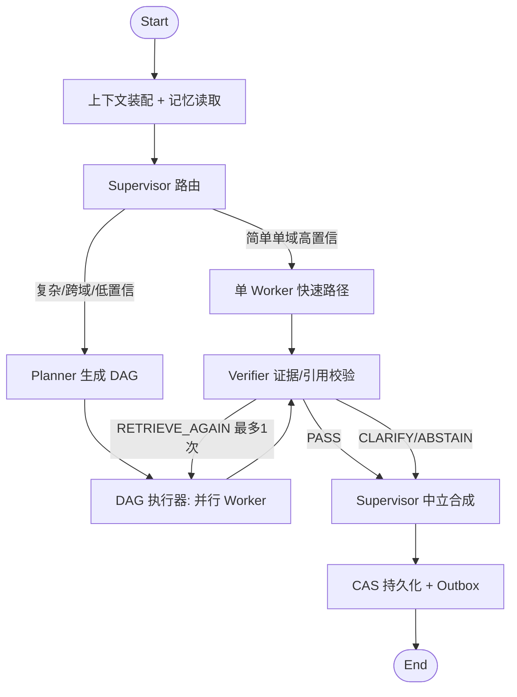

# Agent 编排设计

关联：[architecture.md](./architecture.md) · [ADR-0004](./adr/ADR-0004-langgraph-mysql-checkpoint.md) · [rag-design.md](./rag-design.md) · [memory-design.md](./memory-design.md)

## 1. 设计目标

- Supervisor-Worker 多 Agent：确定性路由优先、模型分类兜底、复杂问题动态 DAG。
- 人格隔离：解决多轮长上下文下的人格漂移，Worker 每次从固定模板重建上下文。
- 有限自治：计划、循环、工具、Token、延迟、成本硬预算。
- 可恢复：LangGraph checkpoint 落 MySQL，任一实例可续跑。

## 2. 类型化 RunState

LangGraph 图状态用 TypedDict，只保存结构化字段；Prompt 全文、大 Tool 结果、原文不入 checkpoint。

```python
class RunState(TypedDict):
    run_id: UUID
    tenant_id: UUID
    user_id: UUID
    conversation_id: UUID
    expected_conversation_version: int
    fencing_token: int
    auth_scope: AuthScope
    user_query: str
    standalone_query: str | None
    route: RouteDecision | None
    plan: ExecutionPlan | None
    task_results: dict[str, TaskResult]
    evidence: list[Evidence]
    memory_refs: list[MemoryRef]
    answer: AnswerDraft | None
    verification: VerificationResult | None
    budgets: RunBudgets  # 剩余预算
    versions: RuntimeVersions  # prompt/model/retrieval/tool schema 版本
```

## 3. 图结构



每个节点执行后写 checkpoint；节点失败/实例中断后，另一实例按 `thread_id=run_id` 从 MySQL 恢复最近 checkpoint 续跑。

## 4. Supervisor 路由

两级：

1. **确定性规则**（优先）：显式实体（merchant_id）、API 能力、命令类型、权限要求、高风险词直接路由。如"最近三次拜访"→ Business Data。
2. **模型分类**（兜底）：对剩余问题输出 `primary_worker`、`secondary_workers`、`complexity`、`required_tools`、`confidence`。

- 高置信单域 → 单 Worker 快速路径。
- 低置信/跨域/复杂 → Planner。
- 路由结果必须满足枚举 Schema，并经权限与工具可用性校验；非法路由回退安全默认 Worker（Knowledge QA）。

```python
class RouteDecision(BaseModel):
    primary_worker: WorkerName
    secondary_workers: list[WorkerName] = []
    complexity: Literal["simple", "complex"]
    required_tools: list[str] = []
    confidence: float
    strategy: Literal["fast_path", "planner"]
```

## 5. 动态 Sub-Question（Planner）

Planner 输出有向无环图（DAG）：

```json
{
  "goal": "为商家制定下一次拜访计划",
  "tasks": [
    {"id": "t1", "worker": "business_data",    "question": "最近拜访结果是什么", "depends_on": []},
    {"id": "t2", "worker": "merchant_analyst", "question": "当前机会和风险是什么", "depends_on": ["t1"]},
    {"id": "t3", "worker": "visit_planner",    "question": "生成拜访方案",       "depends_on": ["t1","t2"]}
  ]
}
```

约束（均由 env 配置上限）：

- 默认最多 4 个 Task、深度最多 3 层、并行度最多 3。
- 每个 Task 声明 Worker、依赖、数据源、Token/时间预算和成功条件。
- Executor 只执行注册过的 Worker 和 Tool。
- Task 失败可按策略跳过、降级或终止，不允许模型自行扩大权限。
- Planner 输出经 Schema + DAG 校验（无环、依赖存在、Worker 合法）；非法则回退单 Worker。

```python
class PlanTask(BaseModel):
    id: str
    worker: WorkerName
    question: str
    depends_on: list[str] = []
    budget: TaskBudget


class ExecutionPlan(BaseModel):
    goal: str
    tasks: list[PlanTask]  # 校验：无环、id 唯一、depends_on 存在
```

## 6. 六类 Worker

| Worker | 职责 | 工具白名单 |
| --- | --- | --- |
| Knowledge QA | 知识/产品/制度问答 | retrieval |
| Sales Coach | 话术、异议处理、沟通建议 | retrieval |
| Business Data | 拜访/销售指标查询 | get_sales_metrics, list_visit_records |
| Merchant Analyst | 商家画像、机会、风险、行动 | get_merchant_profile, analyze_visit_history |
| Intent Analyst | 沟通意图、关注点、异议、阶段分析 | （无外部 tool，纯分析） |
| Visit Planner | 拜访目标、材料、议程、跟进 | build_visit_plan |

每个 Worker：

- 独立 System Prompt（版本化模板）、独立工具白名单、独立上下文视图、独立输出 Schema。
- **每次调用从已发布模板重新构造上下文**，不继承其他 Worker 的人格指令，不使用历史 Assistant 文本恢复人格。
- 输出结构化，Supervisor 只消费结构化字段。

## 7. Intent Analyst 人格隔离（防漂移核心）

"虚拟心理分析师"是该 Worker 的**固定分析框架**，而非全局人格：

- 输入仅含与当前沟通相关的消息、授权商家信息和明确记忆。
- System Prompt 每次从已发布模板重建，不用历史文本恢复。
- 固定输出字段：`observed_signal`、`text_evidence`、`sales_interpretation`、`confidence`、`recommended_action`。
- 禁止诊断疾病、推断受保护属性、将低置信推测表述为事实。
- Supervisor 合成时转为统一销售助手语气；其他 Worker 看不到该人格指令。

```python
class IntentSignal(BaseModel):
    observed_signal: str
    text_evidence: list[str]
    sales_interpretation: str
    confidence: float
    recommended_action: str
```

**漂移防护机制小结**：上下文物理隔离（每个 Worker 独立视图）+ 固定模板重建（不累积人格）+ 类型化输出（不传递自由文本人格）+ Supervisor 中立合成。

## 8. MySQL Checkpointer 设计

实现 LangGraph `BaseCheckpointSaver` 的 async 版本，落 `lg_checkpoints` / `lg_checkpoint_writes`（见 data-model §3.4）：

```python
class MySQLCheckpointSaver(BaseCheckpointSaver):
    async def aput(self, config, checkpoint, metadata, new_versions) -> RunnableConfig: ...
    async def aput_writes(self, config, writes, task_id) -> None: ...
    async def aget_tuple(self, config) -> CheckpointTuple | None: ...
    async def alist(
        self, config, *, filter=None, before=None, limit=None
    ) -> AsyncIterator[CheckpointTuple]: ...
```

要点：

- `thread_id = str(run_id)`，`checkpoint_ns` 支持子图。
- checkpoint/metadata 用 LangGraph 序列化协议 → 存 MySQL `JSON`。
- 与 run 状态可在同一事务内提交，保证一致。
- 恢复：新实例用 `run_id` `aget_tuple` 取最近 checkpoint，继续图执行；配合 fencing token 防旧实例覆盖。
- 契约测试覆盖 put/get/list/writes 与并发恢复。

## 9. 预算与降级

RunBudgets（env 默认，Run 启动冻结）：

- 最大模型调用次数、最大输入/输出 Token、最大 Planner Task 数、最大反思次数、Wall Clock Deadline、单请求/单租户成本上限。

超限行为：返回已获得的可靠部分 + 明确未完成项，不无界循环。Worker/Tool 失败按 architecture §7 降级矩阵处理。

## 10. Supervisor 合成

- 只消费各 Worker 结构化结果与 Verifier 结论。
- 中立统一口吻；保留每个结论的来源与置信度。
- 不把某 Worker 的人格 Prompt 传给最终答案；冲突结论展示来源与时间，不擅自合并。
