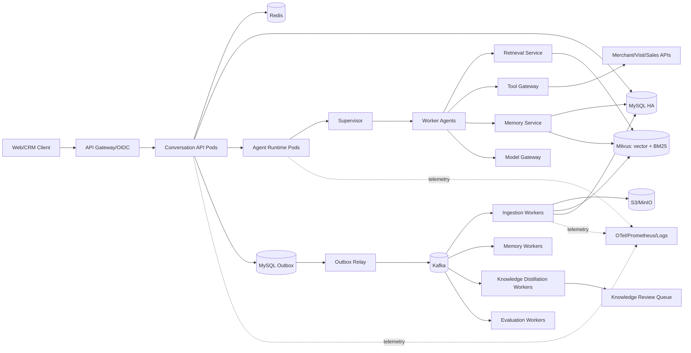
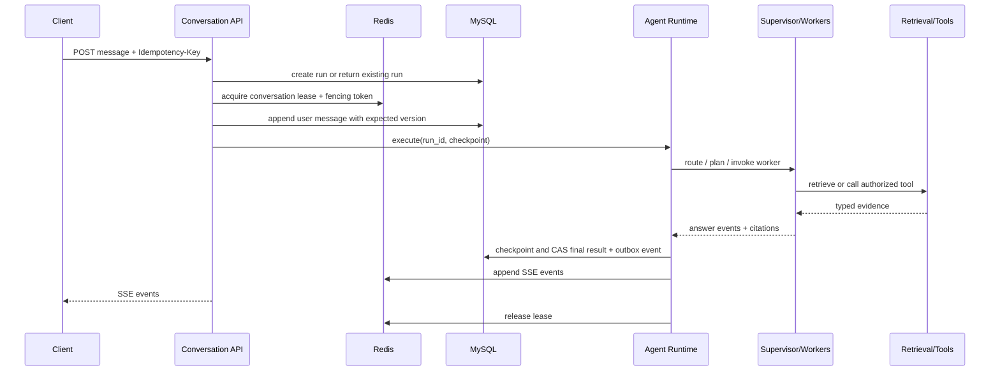
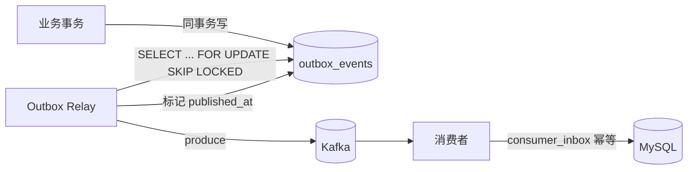

# 总体架构设计

关联：[spec.md](./spec.md) · [ADR](./adr/README.md) · [data-model.md](./data-model.md) · [agent-design.md](./agent-design.md)

## 1. 设计原则

1. **服务无状态，状态外置**：任意 API/Agent/Worker 实例都可接续会话与任务。
2. **证据优先**：模型生成不能越过权限、证据充分度和引用校验。
3. **快慢路径分离**：简单问题直接路由；仅复杂问题启用 Planner、HyDE 和反思。
4. **模型与业务解耦**：LLM、Embedding、Rerank、检索和业务系统均通过 Port 适配。
5. **权限前置**：知识检索在召回前过滤（Milvus 标量过滤），Tool 在调用前鉴权，缓存键包含授权范围。
6. **有限自治**：Agent 的计划、循环次数、工具集合、Token、延迟和成本均有硬预算。
7. **可恢复、可审计**：关键状态持久化到 MySQL，异步事件可重放，知识发布可回滚。
8. **配置即代码**：配置统一走 env，启动冻结，Run 内一致可复现（ADR-0005）。

## 2. 技术基线

| 层次 | 选型 | 说明 |
| --- | --- | --- |
| API | FastAPI + Uvicorn | Async API、SSE、OpenAPI |
| 数据模型 | Pydantic v2 | 边界 Schema 与结构化模型输出 |
| ORM/迁移 | SQLAlchemy 2 Async + asyncmy + Alembic | MySQL 事务与版本迁移 |
| Agent 编排 | LangGraph + 自研 MySQL Checkpointer | 图状态可检查点化，领域逻辑框架无关（ADR-0004） |
| 事务存储 | MySQL 8 (InnoDB) | 会话、消息、Run、记忆、文档元数据、审计、Outbox、Checkpoint（ADR-0001） |
| 缓存与协调 | Redis 7 | 缓存、限流、会话租约、SSE 短期事件流 |
| 检索 | Milvus 2.5 | 向量 KNN + 原生 BM25 稀疏检索、标量过滤、alias（ADR-0002） |
| 对象存储 | S3/MinIO | 原始文件、解析产物、评测报告 |
| 事件总线 | Kafka（本地 Redpanda） | 文档处理、摘要、回流、审计等异步事件（ADR-0003） |
| 模型接入 | Model Gateway | OpenAI 兼容协议，支持主备、限流、熔断 |
| 可观测 | OpenTelemetry + Prometheus + 结构化日志 | Trace、Metric、Log |
| 交付 | Docker + docker-compose（本地）+ Kubernetes/Helm（生产） | 多实例、灰度、回滚 |

领域层只依赖 Python Protocol/抽象接口。开发环境可将 Milvus、Kafka、S3 和业务 API 替换为本地容器或 Mock。

## 3. 总体架构



### 3.1 服务边界

| 服务 | 职责 | 扩容维度 |
| --- | --- | --- |
| Conversation API | 鉴权、请求校验、幂等、SSE、会话读写 | QPS、SSE 连接数 |
| Agent Runtime | Supervisor、Planner、Worker 图执行、Checkpoint | 并发 Run、模型等待 |
| Retrieval Service | Query 构造、双路召回、RRF、重排、证据包 | 检索 QPS、重排批次 |
| Tool Gateway | Tool 注册、授权、调用、脱敏、审计 | Tool QPS、下游依赖 |
| Outbox Relay | 读取 MySQL Outbox 投递 Kafka | Outbox 积压 |
| Ingestion Worker | 解析、切分、元数据、Embedding、索引 | 队列积压、CPU/GPU |
| Memory Worker | 滚动摘要、长期记忆提取和压缩 | 摘要队列积压 |
| Distillation Worker | 经验提炼、Judge、Checker、候选入库 | 回流队列积压 |
| Evaluation Worker | Golden Set、回归、实验报告 | 评测任务数 |

MVP 可以将 Conversation API、Agent Runtime、Retrieval 和 Tool Gateway 部署自同一代码仓库（模块化单体），但必须保持模块边界，并支持后续按负载独立部署。异步 Worker 从一开始就是独立进程。

### 3.2 进程与部署形态

| 进程 | 本地（compose） | 生产（K8s） |
| --- | --- | --- |
| `api` | 1 容器 | Deployment + HPA + PDB，多副本 |
| `agent-runtime`（可与 api 同进程起步） | 同 api | 独立 Deployment |
| `outbox-relay` | 1 容器 | Deployment（单/多副本，行锁保证单投递） |
| `worker-ingestion` / `worker-memory` / `worker-distillation` / `worker-eval` | 各 1 容器 | 各自 Deployment + HPA |

## 4. 在线请求链路



### 4.1 请求状态机

`CREATED -> RUNNING -> (WAITING_DEPENDENCY) -> VERIFYING -> SUCCEEDED`

终止状态：`SUCCEEDED | FAILED | CANCELLED | EXPIRED | CONFLICTED`。每次迁移写入 `run_events`，禁止跳过不可逆状态。

### 4.2 多实例并发控制

1. API 先以 `(tenant_id, idempotency_key)` 在 MySQL 唯一约束创建 Run；冲突时返回原 Run（幂等复用）。
2. 通过 Redis 为 `tenant_id:conversation_id` 获取带 TTL 的可续租 Lease，并分配单调递增 `fencing_token`。
3. 执行期间定时续租（TTL/3）。租约丢失后当前执行立即停止对外写入。
4. 会话保存 `version`。消息追加、Checkpoint 和最终答案使用 `expected_version + fencing_token` 做 CAS（`UPDATE ... WHERE version=?` 判 rowcount）。
5. 即使旧实例网络恢复后继续运行，也会因 fencing token 或版本落后被拒绝。
6. 最终消息与 Outbox Event 在同一 MySQL 事务提交；异步消费者按 `event_id` 去重（`consumer_inbox`）。
7. 不使用进程内 Session、全局可变状态或依赖粘性负载均衡。

### 4.3 SSE 恢复

- 每个 Run 使用 Redis Stream 保存短期事件，事件 ID 作为 SSE `id`。
- 客户端通过 `Last-Event-ID` 续传，默认保留 10 分钟或 2,000 个事件（env 配置）。
- 最终答案、引用和 Run 状态持久化到 MySQL，Redis 丢失只影响 Token 级重放。
- 慢客户端使用有界缓冲；超过上限断开连接，但不取消后台 Run。

## 5. Outbox → Kafka 可靠投递



- 业务写入与 `outbox_events` 同一 MySQL 事务，保证不丢事件。
- Relay 用 `FOR UPDATE SKIP LOCKED` 批量取未发布事件，投递成功后标记；多副本 Relay 不会重复投递同一行。
- 交付语义 at-least-once；消费者用 `consumer_inbox(consumer, event_id)` 唯一约束 + 业务唯一键实现幂等。
- 失败事件重试，超过阈值进死信 topic，人工介入。

## 6. 工程结构

```text
src/sales_assistant/
  api/                  # FastAPI routes, auth, SSE, error mapping
  application/          # use cases 与事务边界
  domain/               # entities, value objects, policies, ports（Protocol）
  agents/
    supervisor/
    planner/
    workers/
    runtime/            # LangGraph 图组装、执行入口
  retrieval/
    query/ recall/ fusion/ rerank/ verification/
  ingestion/
  memory/
  tools/
  knowledge_loop/
  infrastructure/
    mysql/              # SQLAlchemy models, repositories, UoW, checkpointer
    redis/              # lease, event stream, cache, ratelimit
    milvus/             # collection schema, retriever 实现
    kafka/              # producer, consumer, outbox relay
    object_storage/
    model_gateway/
  observability/
  settings/             # Pydantic Settings（env 单层配置）
  workers/              # 异步 worker 进程入口
tests/
  unit/ integration/ contract/ e2e/ evaluation/
deploy/
  docker/ helm/
```

约束：API Handler 不得直接访问基础设施或拼 Prompt。Application 层定义事务边界。Domain 层不依赖 FastAPI、SQLAlchemy、LangGraph、Milvus SDK 或具体模型 SDK。

## 7. 韧性与降级

| 故障 | 行为 |
| --- | --- |
| 主 LLM 不可用 | 熔断后切备用模型；不兼容任务明确失败 |
| Embedding 不可用 | 已索引知识仍可 BM25 召回；新文档延迟处理 |
| Rerank 不可用 | 使用 RRF + 规则排序并标记降级 |
| Milvus 部分故障 | 若无可靠证据则拒答，业务 Tool 路径仍可用 |
| 业务 Tool 超时 | 返回知识侧可靠信息并说明实时数据不可用 |
| Redis 故障 | 禁止新会话并发执行；已完成结果仍可从 MySQL 查询 |
| Kafka 故障 | Outbox 保留事件，在线主链路不丢最终消息 |
| MySQL 故障 | 在线主链路不可用；只读降级依配置 |
| 摘要任务积压 | 增加原始消息窗口或同步使用旧摘要，不阻塞主链路 |

重试仅用于幂等操作，采用指数退避和抖动，并受请求 Deadline 限制。不同模型和 Tool 使用独立并发池，避免级联耗尽。

## 8. 可观测性

- **Trace**：统一 `trace_id`，关键 Span：`auth -> idempotency -> lease -> supervisor -> planner -> worker -> retrieval.vector/bm25 -> rrf -> rerank -> tool -> model -> verifier -> persist -> sse`。不保存隐藏思维链。
- **Metric**：API QPS/错误率/延迟分位、SSE 连接数、路由分布、Planner 触发率、反思率、拒答率、Recall 候选数、Rerank 延迟、证据充分度、模型 Token/首Token/成本、Tool 成功率/超时/熔断、Lease/CAS 冲突、Checkpoint 失败、Kafka Lag、Outbox 积压。
- **Log**：结构化 JSON，默认脱敏；只记录模板版本、Token、Hash、标签和必要摘要。
- **告警**：按 SLO Burn Rate，关联 Dashboard 与 Runbook。

## 9. 安全设计要点

- System/Policy/User/Evidence/ToolResult 明确分区标记；文档与 Tool 返回视为不可信数据，忽略其中"忽略指令"类文本。
- Tool 服务端白名单 + Schema，不接受模型生成的任意 URL/Header/SQL。
- MySQL 行级租户约束 + 应用层双重校验；Milvus 召回前标量 ACL 过滤；Redis Key 使用 tenant 命名空间。
- Secret 由 KMS/Secret Manager 管理，不入代码、镜像、日志。
- 审计日志防篡改，与应用日志分离；支持按 user/tenant 可验证删除（MySQL + Milvus + Redis + 对象存储）。
