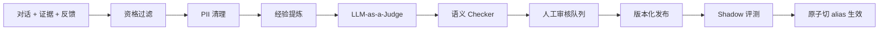

# 知识回流 Pipeline 设计

关联：[architecture.md](./architecture.md) · [rag-design.md](./rag-design.md) · [data-model.md](./data-model.md)

## 1. 目标

建立"对话日志 — 命中知识 — 经验提炼 — 高价值对话回流"的知识沉淀 pipeline，使用 LLM-as-a-Judge 检查语义价值，把高参考价值 Summary 知识落库，形成可持续的知识闭环，且不污染生产知识库。

## 2. 总体流程



Distillation Worker 异步执行，由 Kafka `knowledge.distillation.requested` 触发（对话结束或正反馈信号触发发 Outbox 事件）。

## 3. 关联保存（可追溯性）

系统必须关联保存：对话、Agent 运行轨迹（route/plan/task_results）、命中知识（citations）、引用、用户反馈（feedback）和结果指标。回流候选可追溯到 `source_run_id`，进而到原始对话与证据。

## 4. 候选资格门槛（Filter）

进入提炼需满足：

- 用户明确正反馈，或任务完成信号满足规则；
- 答案 Groundedness、Citation 和 Tool 正确性达到阈值；
- 候选包含可验证来源，不是纯模型观点；
- 不包含禁止回流的数据类型和未授权个人信息；
- 与现有知识相比具有新颖性或明显更好的表达。

## 5. Judge 与 Checker

### 5.1 LLM-as-a-Judge

- 使用**独立 Prompt/模型**（与生成模型适当隔离，降低自评偏差）。
- 输出结构化评分：

```python
class JudgeScore(BaseModel):
    relevance: float
    correctness: float
    reusability: float
    novelty: float
    risk: float
    evidence_support: float
    calibrated_confidence: float
    verdict: Literal["accept_candidate", "reject"]
```

- Judge 通过**不代表自动发布**，只推进到人工审核队列。

### 5.2 语义 Checker

- Embedding + 关键词近重复检测（与现有知识比对）；
- NLI 或规则化矛盾检测；
- 生效时间、过期时间和权威来源比较；
- ACL 继承与敏感级别检查；
- Prompt Injection 和恶意内容扫描。

## 6. 人工审核与发布

- 高价值候选进入 `knowledge_candidates`（review_status=pending）。
- 知识运营审核：approve / reject。
- **模型不能直接发布**候选到生产知识库。
- 发布：写入 Milvus shadow collection → Shadow 评测（回归 Golden Set）→ 通过后原子切 `knowledge_active` alias。
- 撤销：revoke 后检索、缓存、后续回流均不再使用该知识。
- 审核、发布、撤销、版本切换全程写审计日志，可追溯原始对话与证据。

## 7. 防止知识自污染

- 每条回流知识记录 `provenance_type` 和原始证据。
- 由模型生成的候选**不能仅引用另一条模型生成知识**。
- 限制知识衍生深度；缺少一级权威来源时必须人工补证。
- 已撤销或低评分知识自动从后续候选证据中排除。

## 8. 状态机

`pending -> approved -> published -> (revoked)`；`pending -> rejected`。

每次状态迁移写审计。published 后经 shadow 评测门禁才真正切 alias 生效。

## 9. 领域 Port

```python
class KnowledgeDistiller(Protocol):
    async def extract_candidate(self, run_id: UUID) -> Candidate | None: ...


class KnowledgeJudge(Protocol):
    async def score(self, candidate: Candidate) -> JudgeScore: ...


class KnowledgeChecker(Protocol):
    async def check(self, candidate: Candidate) -> CheckResult: ...
```

模型走 Model Gateway（Judge 用独立路由），检索比对走 Retriever，落库走 Repository。

## 10. 可观测与验收

指标：候选生成率、Judge 通过率、Checker 拦截率、人工通过率、发布回滚率、**高价值知识回流误发布数（目标 0）**。误发布为 0 是硬门禁。
