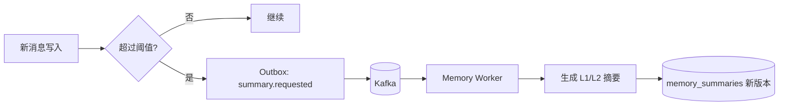

# 记忆工程设计

关联：[architecture.md](./architecture.md) · [agent-design.md](./agent-design.md) · [data-model.md](./data-model.md)

## 1. 目标

- 两层记忆治理：短期（滑动窗口 + 异步摘要）+ 长期（稳定事实/偏好/经验）。
- 记忆压缩与分层，避免长上下文人格漂移与摘要失真。
- 提供 Skills 能力接入（拜访分析、拜访规划等规划任务）。
- 多实例一致访问：记忆状态在 MySQL + Milvus，不在进程内存。

## 2. 上下文装配顺序

每个 Worker 调用前按固定顺序装配，各部分有独立 Token Budget：

1. 固定且已发布的 Worker System Prompt。
2. 当前用户身份、权限、时间和任务约束。
3. 当前 Run 的计划与 Task 结果。
4. 最近 N 轮原始消息。
5. 覆盖更早消息的最新滚动摘要。
6. 与当前问题相关且授权的长期记忆。
7. 检索 Evidence 或 ToolResult。

低优先级上下文先压缩或丢弃；System Prompt、权限、当前问题不可截断。

## 3. 短期记忆（滑动窗口 + 异步摘要）

- 原始消息不可变保存于 MySQL `messages`。
- 默认装载最近 8 轮（env `stm_recent_turns`），按模型上下文动态调整。
- 达到消息数或 Token 阈值 → 发 Kafka `conversation.summary.requested`，Memory Worker 异步生成摘要，**不阻塞主请求**。
- 摘要任务处理明确消息区间 `[start_message_id, end_message_id]`。
- 摘要写入带 `source_version` 的新版本；若会话已推进，只追加新摘要，不覆盖较新的摘要。
- 摘要内容：事实、已确认目标、未解决问题、关键实体、承诺；**不保存人格指令**。



## 4. 长期记忆

类型：`preference`、`entity_fact`、`goal`、`decision`、`successful_playbook`。每条含来源、置信度、有效期、敏感级别、状态。

写入流水线（Memory Worker 异步）：

```text
extract -> classify -> PII policy -> deduplicate -> conflict check -> confidence gate -> persist(MySQL) + index(Milvus)
```

- **extract**：从对话/Run 结果抽取候选。
- **classify**：归类到 5 种类型。
- **PII policy**：清理无关个人敏感信息。
- **deduplicate**：Embedding + 关键词近重复检测。
- **conflict check**：与已有记忆矛盾检测（NLI/规则）。
- **confidence gate**：低置信不入库。
- **persist/index**：元数据入 MySQL `memory_items`，可检索向量入 Milvus `long_term_memory`（`milvus_pk` 关联）。

读取排序：综合相关性、近期性、置信度、类型权重。长期记忆始终作为"可能有用的历史信息"，**不得覆盖当前用户指令或权威业务数据**。

### 4.1 用户/租户控制

- 用户可禁用长期记忆（`users.ltm_enabled=0`）：禁用后不写入、不读取该用户长期记忆。
- 租户可配置保留期限和删除策略（`tenants.retention_days`）；过期记忆状态置为 revoked 并清理 Milvus。

## 5. 压缩策略（分层）

| 层 | 内容 | 触发 |
| --- | --- | --- |
| L0 | 最近原始消息 | 实时 |
| L1 | 每 6–10 轮段摘要 | 阈值触发异步 |
| L2 | 多段摘要合并为会话摘要 | 段摘要累积触发 |
| L3 | 稳定事实提取为长期记忆 | 会话结束/回流触发 |

每层保留来源 ID。摘要模型升级不原地改写旧记录，生成新版本并可回滚（对齐知识回流版本化原则）。

## 6. Skills 能力接入

Skills 是可被 Worker/Planner 调用的**纯计算或规划任务**，实现为 Tool Registry 中的内部 Tool（区别于外部只读 API Adapter）：

| Skill | 输入 | 输出 |
| --- | --- | --- |
| `analyze_visit_history` | 标准化拜访记录 | 趋势、异议、待办 |
| `build_visit_plan` | 目标、商家摘要、证据 | 结构化拜访规划 |

- Skills 无外部副作用，输入输出有 Schema，纳入 Tool Gateway 的校验、超时、审计。
- 供 Business Data / Merchant Analyst / Visit Planner 等 Worker 组合调用完成规划任务。

## 7. 领域 Port

```python
class MemoryStore(Protocol):
    async def load_short_term(
        self, tenant_id, conversation_id, *, budget: TokenBudget
    ) -> ShortTermContext: ...
    async def load_long_term(
        self, tenant_id, user_id, query: str, *, top_k: int
    ) -> list[MemoryItem]: ...
    async def request_summary(self, conversation_id, message_range) -> None: ...  # 发 Outbox 事件
```

MySQL + Milvus 为其实现，领域层不感知存储细节。

## 8. 测试要点

长对话跨实例一致、摘要失真检测、记忆污染防护、记忆冲突处理、用户禁用开关生效、租户保留期删除。
