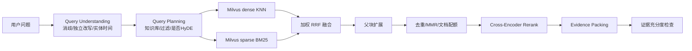

# Agentic RAG 检索链路设计

关联：[architecture.md](./architecture.md) · [ADR-0002](./adr/ADR-0002-vector-milvus.md) · [data-model.md](./data-model.md)

## 1. 目标

构建向量 + BM25 双路混合召回，RRF 粗排、父块扩展、去重、Cross-Encoder 重排、证据充分度门禁，结合 sub-Question 规划、HyDE 和反思机制，解决知识命中率、准确率与幻觉问题。

## 2. 文档处理流水线


（Ingestion Worker 异步执行，由 Kafka `document.ingestion.requested` 触发。）

### 2.1 切分参数（env 可配，默认值）

| 参数 | 默认 | 说明 |
| --- | --- | --- |
| Parent Chunk | 1,200–1,800 tokens | 按标题边界优先切分 |
| Child Chunk | 250–400 tokens | 用于检索 |
| Overlap | 50–80 tokens | 只在同章节内重叠 |
| 向量维度 | 由 Embedding 模型决定 | 记录模型和维度版本 |
| 双路候选 | 各 Top 50 | ACL 过滤后返回 |
| RRF 常数 k | 60 | 离线评测调优 |
| Rerank 输入 | Top 40 | 控制时延成本 |
| 最终证据 | Top 6–10 | 受 Token Budget 约束 |

切分器按文档类型路由：表格保留表头并生成行级 Child；列表保留父标题；代码/公式不在语义单元中间切断。

### 2.2 Chunk 元数据

`tenant_id`、`knowledge_base_id`、`document_id`、`document_version_id`、`parent_id`、`child_id`、`section_path`、`page`、`offset`、`title`、`language`、`product`、`region`、`effective_at`、`expires_at`、`security_level`、`acl_tokens`、`source_hash`、`parser_version`、`chunker_version`、`embedding_model`、`index_schema_version`。

## 3. 检索流程



1. **Query Understanding**：消歧、独立问题改写、实体和时间范围抽取。保留原问题供生成使用。
2. **Query Planning**：确定知识库、过滤条件、是否启用 Sub-Question/HyDE。
3. **Parallel Recall**：原查询（及允许的扩展查询）分别执行 Milvus dense KNN 与 sparse BM25。**两路查询均带标量 ACL 过滤表达式**（tenant/status/acl/时效），召回前过滤。
4. **RRF Fusion**：按召回器可靠性和查询类型加权融合。
5. **Parent Expansion**：用命中 Child 找回 Parent，保留命中位置。
6. **Dedup/Diversity**：按 source_hash 去重，MMR/每文档配额避免单文档垄断。
7. **Cross-Encoder Rerank**：对 Query 与候选 Child/Parent 摘要重排。
8. **Evidence Packing**：按相关性、权威性、时效、Token Budget 组装证据包。
9. **Sufficiency Check**：判断覆盖、冲突、时效和可回答性。

### 3.1 双路召回与 RRF

Milvus 2.5 支持在单次 `hybrid_search` 中同时对 dense 和 sparse 字段检索并融合，但为可控性与可观测性，我们**在应用层显式做加权 RRF**：

```text
score(d) = sum_i ( weight_i / (k + rank_i(d)) )
```

- `weight_dense` / `weight_bm25` 由 env 配置，可按查询类型调整。
- RRF 分数只用于粗排，最终顺序由 Cross-Encoder + 权威性 + 时效 + 业务规则决定。

### 3.2 ACL 过滤表达式（Milvus）

```text
tenant_id == "{tid}"
  && status == "published"
  && ARRAY_CONTAINS_ANY(acl_tokens, {user_acl_tokens})
  && effective_at <= {now}
  && (expires_at == 0 || expires_at > {now})
  && security_level in {allowed_levels}
```

禁止先召回后过滤；无租户上下文的检索一律拒绝。

## 4. HyDE 策略

仅在以下任一条件触发（env 开关 + 阈值）：

- 查询过短/抽象，缺可检索实体；
- 概念性问题与企业文档表达差异大；
- 首轮 Top-K 低于相似度/充分度阈值；
- Planner 明确标记需要术语扩展。

HyDE 最多生成 1–2 个假设文档，**仅用于生成查询向量**。不进入 Evidence、不生成引用、不参与事实判定。启用 HyDE 后仍须通过真实文档证据门禁。

## 5. 反思与防幻觉

Verifier 输出：

```python
class VerificationResult(BaseModel):
    coverage: float  # 问题各部分是否有证据
    citation_entailment: float  # 引用是否支持结论
    conflicts: list[Conflict]  # 来源间冲突
    freshness_ok: bool  # 时效是否满足
    unsupported_claims: list[str]  # 无依据事实
    decision: Literal["PASS", "RETRIEVE_AGAIN", "CLARIFY", "ABSTAIN"]
```

- `RETRIEVE_AGAIN` 默认最多 1 次，必须生成**不同**的检索策略；再次失败禁止继续循环。
- 生成阶段规则：
  - 仅使用 Evidence 和授权 ToolResult 中的事实；
  - 每个事实段绑定 Citation ID；
  - 引用校验失败时删除、降级为建议或拒答；
  - 来源冲突时展示冲突与时间，不擅自合并；
  - Prompt 中将检索文档标记为不可信数据，忽略文档内指令；
  - 低证据答案使用明确的不确定性表达。

## 6. 领域 Port

```python
class Retriever(Protocol):
    async def hybrid_search(
        self,
        *,
        tenant_id: UUID,
        query: str,
        query_vector: Sequence[float],
        acl_tokens: Sequence[str],
        filters: RetrievalFilters,
        top_k: int,
    ) -> list[Candidate]: ...


class Embedder(Protocol):
    async def embed(self, texts: Sequence[str]) -> list[list[float]]: ...


class Reranker(Protocol):
    async def rerank(
        self, query: str, candidates: Sequence[Candidate], top_k: int
    ) -> list[Candidate]: ...
```

Milvus 为 `Retriever` 的实现；Embedder/Reranker 走 Model Gateway。领域层不依赖 pymilvus。

## 7. 索引发布与回滚

- 新版本写入 shadow collection/分区 → 完整性抽样验证 → 原子切 `knowledge_active` alias。
- 旧版本在新版本就绪前继续服务；回滚即切回旧 alias。
- 删除产生可审计索引清理任务，按 tenant/document_version 过滤删除 Milvus 记录。

## 8. 可观测指标

Recall 候选数、双路重叠率、RRF 分布、Rerank 延迟/批次、证据充分度、HyDE 触发率、反思率、拒答率、Citation Precision、Groundedness。离线 Golden Set 评测 Recall@20/NDCG@10（见 tasks 评测部分）。
