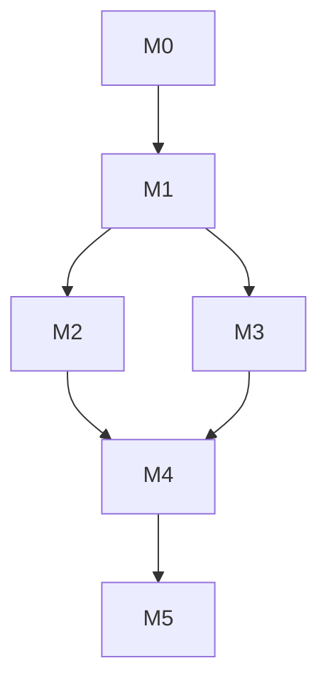

# 实施任务

关联：[spec.md](./spec.md) · [architecture.md](./architecture.md) · [checklist.md](./checklist.md)

## 1. 执行约定

- 每项任务同时完成代码、测试、可观测性和必要文档。
- `P0` 阻塞 MVP，`P1` 可在 MVP 后增强。
- 每个里程碑交付可运行、可演示、可回滚的纵向能力。
- 领域层不依赖 FastAPI/SQLAlchemy/LangGraph/Milvus/模型 SDK。

## 2. 里程碑

| 里程碑 | 交付 | 
| --- | --- |
| M0 | 工程与本地全栈基线 |
| M1 | 多实例会话与单 Worker 知识问答 |
| M2 | 企业文档处理与 Milvus 混合检索 |
| M3 | Supervisor-Worker 与业务 Tool |
| M4 | Agentic Planner、HyDE、反思与记忆 |
| M5 | 知识回流、评测、安全与生产化 |

## 3. 任务清单

### M0 工程与本地全栈基线

- [ ] `T-001 P0` 初始化 Python 3.12 工程、uv 依赖锁、目录边界。
- [ ] `T-002 P0` 接入 Ruff、mypy、Pytest、覆盖率、pre-commit、Makefile。
- [ ] `T-003 P0` FastAPI 应用、健康检查、错误模型、Request ID、OTel 中间件。
- [ ] `T-004 P0` docker-compose 全栈：MySQL/Redis/Milvus/Redpanda/MinIO + `make up`。
- [ ] `T-005 P0` Alembic 迁移基线、MySQL utf8mb4/BINARY(16)/DATETIME(6) 规范。
- [ ] `T-006 P0` env 单层配置（Pydantic Settings）+ 生产守卫校验。
- [ ] `T-007 P0` 领域 Port：Model、Embedding、Rerank、Retriever、Tool、Memory、EventBus、Checkpointer。
- [ ] `T-008 P0` Dockerfile 非 root、CI（lint/type/test/迁移/安全扫描）。

**完成条件**：一条命令起全栈；CI 全绿；健康检查可用。

### M1 多实例会话与单 Worker 知识问答

- [ ] `T-101 P0` tenant/user/conversation/message/agent_run/run_event MySQL 模型 + 仓储。
- [ ] `T-102 P0` OIDC/JWT 鉴权骨架、RBAC+ABAC Policy 接口、tenant 强制条件。
- [ ] `T-103 P0` 会话创建、消息分页、消息发送、Run 查询/取消 API。
- [ ] `T-104 P0` Idempotency-Key 唯一约束、重复请求结果复用。
- [ ] `T-105 P0` Redis Lease、续租、fencing token、MySQL CAS。
- [ ] `T-106 P0` Redis Stream SSE、Last-Event-ID 续传、慢客户端保护。
- [ ] `T-107 P0` LangGraph Runtime + 自研 MySQL Checkpointer。
- [ ] `T-108 P0` Model Gateway OpenAI-compatible Adapter：超时/重试/熔断 + Mock Provider。
- [ ] `T-109 P0` 最小 Knowledge QA Worker、结构化答案与引用模型。
- [ ] `T-110 P0` 双实例并发、租约过期、实例退出、断线恢复集成测试。

**完成条件**：两实例可处理同一会话；重复请求不重复执行；问答可流式返回并恢复。

### M2 企业文档处理与 Milvus 混合检索

- [ ] `T-201 P0` 知识库/文档/版本/ACL 数据模型。
- [ ] `T-202 P0` 上传、对象存储、Hash 去重、格式检查、状态 API。
- [ ] `T-203 P0` PDF/DOCX/PPTX/HTML/MD/Text 解析适配器。
- [ ] `T-204 P0` 标题/段落/列表/表格/页码结构化标准模型。
- [ ] `T-205 P0` Parent-Child Chunking、Overlap、元数据增强、版本记录。
- [ ] `T-206 P0` Embedding 批处理、限速、重试、幂等索引。
- [ ] `T-207 P0` Milvus collection schema：dense HNSW + sparse BM25、analyzer、alias。
- [ ] `T-208 P0` Query Rewrite、实体/时间过滤、双路并行召回（带 ACL 标量过滤）。
- [ ] `T-209 P0` 加权 RRF、父块扩展、去重、文档配额、Evidence Packing。
- [ ] `T-210 P0` Cross-Encoder Rerank Adapter、批量重排、不可用降级。
- [ ] `T-211 P0` 证据充分度、引用映射、Unsupported Claim 检查、拒答。
- [ ] `T-212 P0` 文档发布、Shadow 验证、Milvus alias 原子切换、回滚、删除。
- [ ] `T-213 P0` 检索 Golden Set + Recall@K/NDCG/Citation 评测命令。
- [ ] `T-214 P1` OCR 与复杂表格解析。

**完成条件**：文档可版本化接入；权限过滤 100% 正确；混合检索与引用指标达门槛。

### M3 Supervisor-Worker 与业务 Tool

- [ ] `T-301 P0` Worker 注册中心、独立 Prompt、工具白名单、输出 Schema。
- [ ] `T-302 P0` 确定性路由规则 + 模型 Route Classifier。
- [ ] `T-303 P0` Supervisor 调度与中立答案合成。
- [ ] `T-304 P0` Sales Coach Worker 与话术安全规则。
- [ ] `T-305 P0` Business Data Worker。
- [ ] `T-306 P0` Merchant Analyst Worker。
- [ ] `T-307 P0` Intent Analyst Worker、人格隔离、非诊断约束。
- [ ] `T-308 P0` Visit Planner Worker。
- [ ] `T-309 P0` Tool Registry、Schema 校验、授权、Deadline、脱敏、审计。
- [ ] `T-310 P0` 商家/拜访/指标只读 API 契约 + Mock Adapter。
- [ ] `T-311 P0` 真实业务 API Adapter + Consumer-driven Contract Test。
- [ ] `T-312 P0` Tool 缓存（键含 tenant + auth_scope_hash + data_version）。
- [ ] `T-313 P0` 跨 Worker 人格污染、越权 Tool、下游故障测试。

**完成条件**：六类 Worker 可路由；只读业务数据可安全查询；Worker 上下文与人格隔离。

### M4 Agentic Planner、HyDE、反思与记忆

- [ ] `T-401 P0` ExecutionPlan/Task/Budget/TaskResult Schema。
- [ ] `T-402 P0` 复杂度分类、快速路径、Planner 触发规则。
- [ ] `T-403 P0` Sub-Question DAG 校验、并行执行、依赖处理、局部降级。
- [ ] `T-404 P0` 模型调用数/Token/成本/并发/Wall Clock 硬预算。
- [ ] `T-405 P0` HyDE 条件触发、假设文档隔离、效果埋点。
- [ ] `T-406 P0` Verifier、有限补检、冲突展示、澄清、拒答。
- [ ] `T-407 P0` 上下文 Token Budget 与确定性裁剪。
- [ ] `T-408 P0` 最近消息 + L1/L2 滚动摘要 + 异步事件（Kafka）。
- [ ] `T-409 P0` 摘要版本、来源范围、冲突保护、周期重建。
- [ ] `T-410 P0` 长期记忆提取/类型/去重/冲突/敏感性/过期。
- [ ] `T-411 P0` 长期记忆相关性读取、用户/租户禁用开关。
- [ ] `T-412 P0` 长上下文、摘要失真、记忆污染、预算超限、循环终止测试。

**完成条件**：复杂问题可有限规划与反思；简单问题延迟不被拉高；跨实例长对话一致。

### M5 知识回流、评测、安全与生产化

- [ ] `T-501 P0` 关联保存对话/Run/Evidence/Citation/Tool/Feedback。
- [ ] `T-502 P0` 候选资格过滤、PII 清理、经验结构化提炼。
- [ ] `T-503 P0` LLM-as-a-Judge Schema、独立模型路由、校准集。
- [ ] `T-504 P0` Semantic Checker：重复/矛盾/时效/权限/恶意内容。
- [ ] `T-505 P0` 人工审核、驳回、发布、撤销、全链路审计 API。
- [ ] `T-506 P0` Milvus Shadow 索引回归、发布门禁、alias 切换。
- [ ] `T-507 P0` Outbox/Inbox、Kafka 幂等消费、重试、死信。
- [ ] `T-508 P0` Trace/Metric/结构化日志/Dashboard/SLO/告警。
- [ ] `T-509 P0` Prompt Injection、越权、DLP、限流、资源耗尽安全测试。
- [ ] `T-510 P0` >=500 条 Golden Set + 10% 业务专家盲审。
- [ ] `T-511 P0` 负载、长稳、故障注入、数据恢复、回滚演练。
- [ ] `T-512 P0` Helm 生产配置、HPA/PDB、Canary、迁移 Job。
- [ ] `T-513 P0` 运维 Runbook、数据删除 Runbook、事故响应。
- [ ] `T-514 P0` 上线评审与分阶段灰度。

**完成条件**：所有发布门禁通过，生产灰度可观测、可停止、可回滚。

## 4. 依赖

外部阻塞项：OIDC/租户规范、业务 API 及测试环境、模型/Embedding/Rerank 服务与合规、部署资源、文档样本与 Golden Set。

## 5. 首个迭代

先做 M0（T-001~T-008）+ M1（T-101、T-103~T-107、T-109），交付：
- 可启动的 Python 服务 + 本地全栈；
- CI 质量门禁；
- 会话/消息最小 API + 多实例并发控制；
- LangGraph MySQL checkpoint + Mock 模型的单 Worker 问答（流式 + 恢复）。
